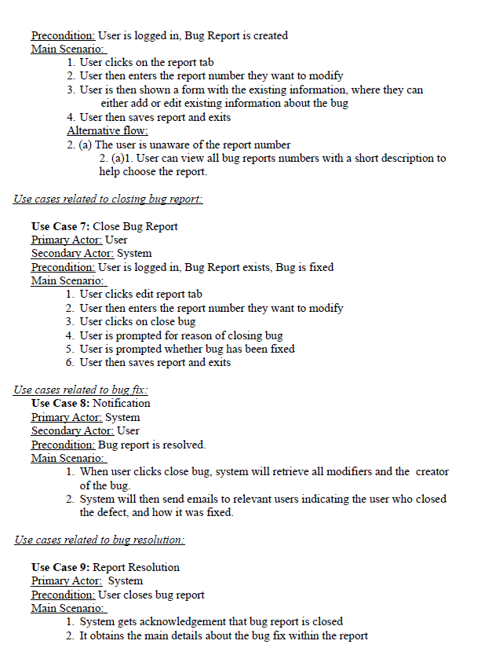
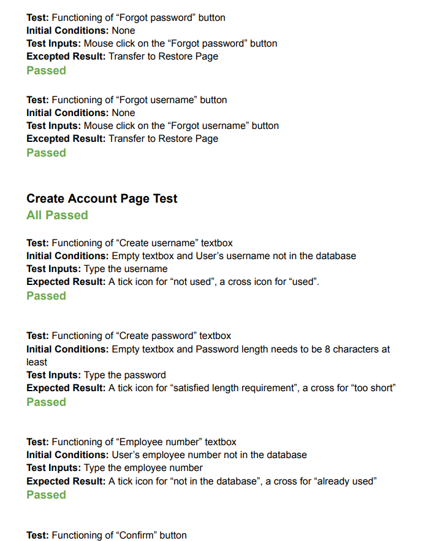
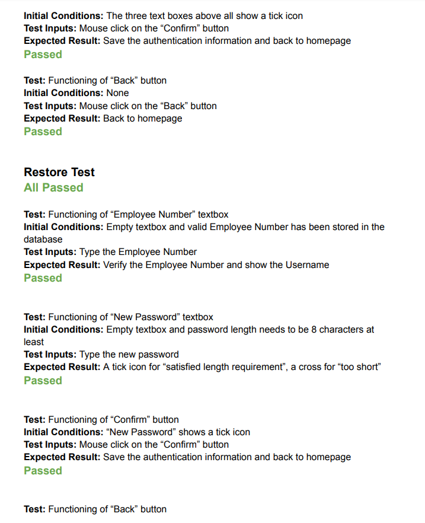

# cps406_project_group52
## Team Members:
Vicheka Oeun,
Hongyu Jin,
Param Chauhan,
Nami Dilipbhai Hirpara,
Dhruvi Paresh Thakkar,
Ansh Ansh

## 1. Executive Summary:
The purpose of this program is to let users input bugs/errors into a database. The program should
be an easy and friendly script where the user can easily figure out how to implement it. Users
will need internet connection and certain network abilities enabled for the web form to work
properly.
### 1.1 Purpose:
The Bug Reporting System (BRS) is intended to help the user keep track of bugs/defects in
design documents, diagrams, formal specs, source files, test source files, binaries and data
files. Tracking of the bug will be done by means of keeping track of the “originator” of the
bug, type of bug, short description, and any other data that is relevant. This will allow users
to keep track of the progress of the defect fix.

## 2. How the build works:
Here's some info about our main files, In "app.py", we've built a Flask app to manage user registration and accounts. It talks to a SQLite database, securely storing passwords and providing features like password resets and username updates. "databaseSet.py" ensures smooth database operations for our Flask app, setting up connections and configuring settings like timeout for locks. "functions.py" helps with database interactions, like validating credentials, fetching posts, and adding comments. Lastly, "loaddata.py" handles saving user info for login and system use.
<br>
Our Login.js acts as the default url '/' it is the first page users see once they go to our website. Route.js uses the react-router-dom library from React to create seamless routes between pages. Each JavaScript contains functions to send requests to the back-end flask app to perform various requests like GET and POST to retrieve user data or add user data to our SQLite database. The components folder contains component JavaScript files leveraging React's modularization of files so we can reuse Titlecard and BugCard for different pages without having to rebuild.

### 2.1. What it looks like:


<br>

### 2.2. Technologies we used:
- Front-end:
JavaScript (React), HTML, CSS
- Back-end:
Python (Flask), SQLite

### 2.3. Setup:
Make sure to have:
- pip installed
- node.js installed

### 2.4. How to run:
To run our website you need to:
Install all the dependencies:
```
npm install
```
On the home directory, run:
```
python3 app.py
```
Then run whenever you make any changes:
```
npm run build
```
Finally our website runs on port:
```
http://127.0.0.1:5000/
```

## 3. Specific Requirements
### 3.1. Functional Requirements:
We describe the functional requirements by giving various use cases.
<br>

<br>

<br>

<br>

<br>

### 3.2. Performance Requirements:
The script should be able to run on any 32/64 bit machines. The site should be compatible
with any web browser (ie Internet Explorer, Google Chrome, Firefox)

### 3.3. Design Constraints:
1. Accessibility: Anyone should be able to use and navigate through the website.
2. Reliability: People should be able to login, check and submit any bug reports
without issue and be notified when the bug is fixed.

### 3.4. External Interface Requirements:
The login screen requires a username or password from the user to enter BRS, and the
option to create a new account. There is also an option if the user has forgotten their
password/username. The bug reporting form provides allows the user to input a report number,
type of bug and a short summary of the bug, and provides options such as a help screen, bug
library and password change form on the right side. The user can then save, submit, or cancel
their bug report. Appendix A shows a rough example of the planned user screen.

## 4. Team velocity diagram


## 5. Product Backlog

<br>

<br>

<br>

<br>


## 6. Test Report

<br>

<br>

<br>

<br>

<br>

<br>

<br>